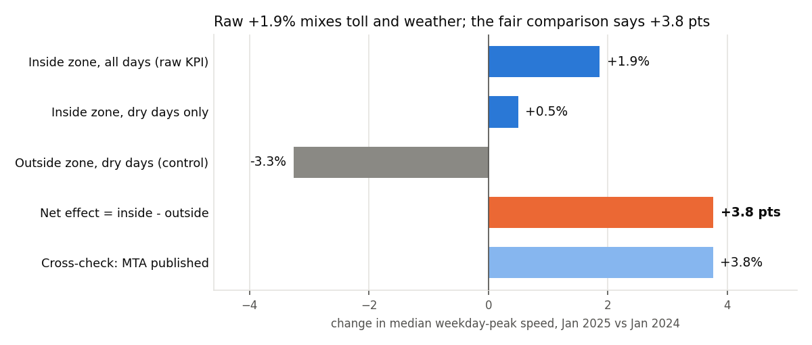
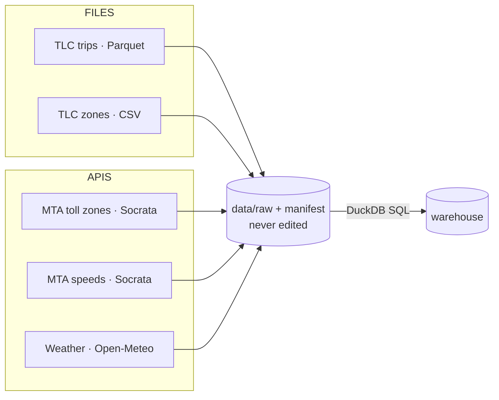
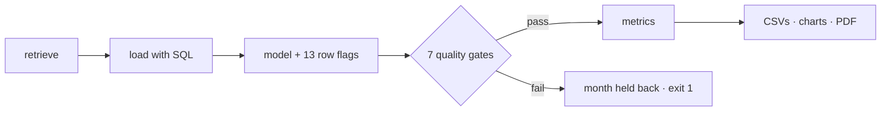

# Did congestion pricing make Manhattan taxis faster?

**FDE Data Foundations, Assignment 2** · Track B: NYC TLC trip data · Jan 2024 vs Jan 2025

| Submission item | Where |
|---|---|
| 2-page report | [`FDE_Assignment2_Report.pdf`](FDE_Assignment2_Report.pdf) |
| Pipeline (retrieve → validate → model → metrics) | [`tlc_pipeline/`](tlc_pipeline/), run with `python -m tlc_pipeline.pipeline` |
| Source map · data model | [`docs/source_map.md`](docs/source_map.md) · [`docs/data_model.md`](docs/data_model.md) |
| Evidence table (5 KPIs + 4 controls, gates, rules) | [`output/evidence.md`](output/evidence.md) |
| Walkthrough notebook | [`notebooks/walkthrough.ipynb`](notebooks/walkthrough.ipynb) |
| In-class challenge notebooks (Classes 5–7) | [`class_notebooks/`](class_notebooks/) |

## The problem and the answer

| Problem | Stakeholders | KPI | Decision | Answer |
|---|---|---|---|---|
| NYC began tolling Manhattan below 60th St on **5 Jan 2025** to cut congestion. Is it working? | MTA (owns the toll) · TLC (owns the data) · NYC DOT | **Median speed of taxi trips inside the zone, weekdays 5am–9pm** | Keep or adjust the toll | **Yes, modestly: +3.8 points faster than the rest of the city** |

| Net effect | Raw KPI | Crawling (<5 mph) | Slowest 10% | Zone trips / weekday | Toll charged |
|:-:|:-:|:-:|:-:|:-:|:-:|
| **+3.8 pts** | +1.9% | −8.4% | −2.2% min/mile | +24% | 98.4% |



**Judgement call: don't report the raw +1.9%.**

| | |
|---|---|
| Problem | January 2024 had **8 of 18** wet weekdays, January 2025 only **2 of 19**, so the raw number mixes the toll with the weather |
| Fix | Compare dry days only, inside the zone against trips outside it (control) |
| Check | In line with the MTA's own published zone speed (taxis and ride-hail, all hours): **+3.8%** |


## Sources → [source map](docs/source_map.md)



| Question | Source (owner) | Completeness check |
|---|---|---|
| Did trips get faster? | TLC trip records, 6.44 M rows (TLC) | bytes match the server; rows = file metadata = loaded rows |
| Which trips are tolled? | TLC zone list + MTA toll zones | 265 zones, 38 tolled, all in Manhattan |
| Could weather explain it? | Open-Meteo archive | one record per day |
| Do official figures agree? | MTA zone speeds | paged records = API `count(*)` |

## Pipeline → [data model](docs/data_model.md)



| Rerun-safe | Failure handling | Tests |
|---|---|---|
| raw files reused if checksum matches · one transaction per month · atomic output files | retry with backoff · schema drift rejected · last good output kept | 7 offline tests (`pytest`) |

## Validation: flag, never delete


| Found in the raw data | $863,380 fare | 312,722-mile trip | pickups dated 2002 | a vendor whose trips all last 0 seconds | 15.5% of rows with no passenger count |
|---|---|---|---|---|---|

## Facts · assumptions · unknowns

| Facts | Assumptions | Unknowns / limitations |
|---|---|---|
| Zone speed +1.9%, crawling −8.4% | Whole-trip speed reflects zone traffic | Trips that only pass through the zone (no GPS) |
| +3.8 pts vs outside the zone, dry days | A negative total is a refund, not a trip | Why 1.6% of zone trips paid no toll |
| Taxi trips in the zone +24% | One weather point covers the city | One month per side; +3.2 pts if trace snow counts as wet |
| Toll charged on 98.4% of zone trips | Timestamps are NYC local time | Taxis only; shows association, not cause |

## In-class challenge notebooks → [class_notebooks](class_notebooks/)

| Class | Notebook | Main finding |
|---|---|---|
| 5 · Retrieval | [Class 5](class_notebooks/flasheats/FlashEats_Class5_Student.ipynb) | Late deliveries build up **before pickup**; the dispatch API needs retries, and completeness is proven (1,600 of 1,600 records) |
| 6 · Validation | [Class 6](class_notebooks/flasheats/FlashEats_Class6_Student.ipynb) | "56% late" is reproducible but not publishable: definitions range from 23% to 57% and no KPI owner exists |
| 7 · Modelling | [Class 7](class_notebooks/flasheats/FlashEats_Class7_Challenge.ipynb) | Order-centric model; 74% of frustrated late journeys got no intervention |

## Run it

```bash
pip install -r requirements.txt
python -m tlc_pipeline.pipeline      # downloads ~110 MB of trip data, verifies it, rebuilds every output
python -m pytest -q                  # 7 offline tests
python docs/build_report_pdf.py      # regenerates the 2-page PDF from the outputs
```

Options: `--months 2024-01 2025-01` · `--refresh` (re-download files) · `--refresh-api` (re-pull API snapshots). Every threshold lives in [`tlc_pipeline/config.py`](tlc_pipeline/config.py).

## Repository layout

```
├── FDE_Assignment2_Report.pdf   2-page report
├── tlc_pipeline/                retrieve · ingest · validate · model · metrics · report · pipeline
├── tests/                       offline tests (rules, reruns, partial files, schema drift)
├── notebooks/                   walkthrough: profiling, validation, model, metrics
├── docs/                        source map, data model, PDF builder
├── output/                      evidence tables and charts produced by the pipeline
├── data/raw/                    raw API snapshots, zone list and manifest (trip files are re-downloaded)
└── class_notebooks/             completed FlashEats notebooks for Classes 5–7, with their data
```
