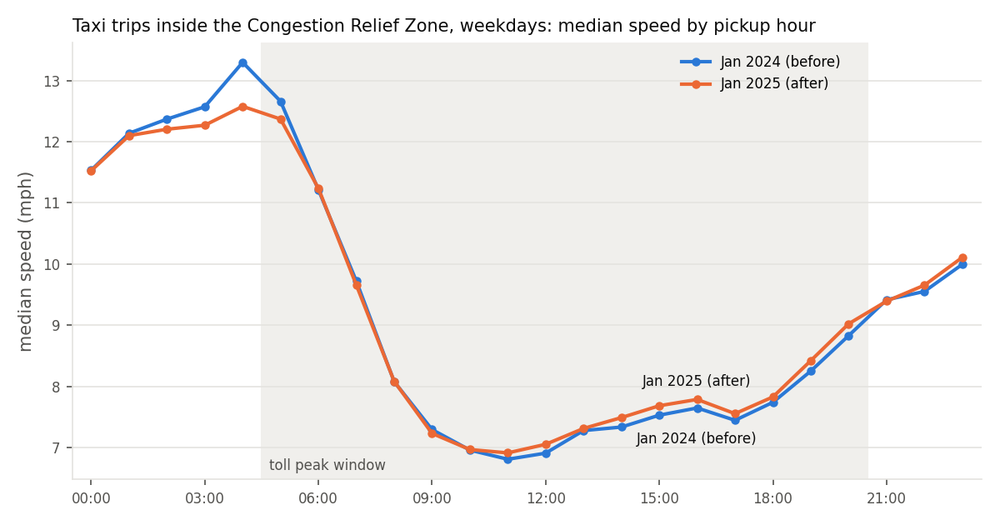
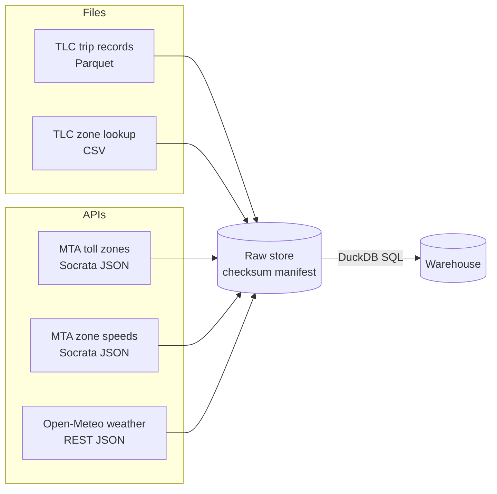
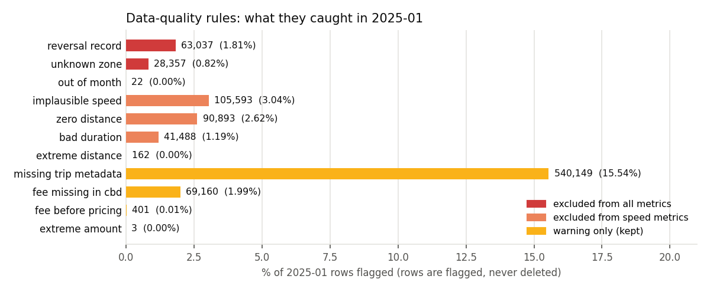
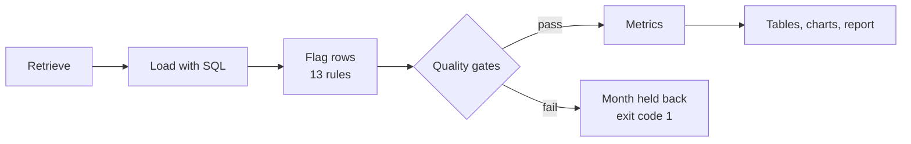

# NYC Congestion Pricing: Taxi Speed KPI Pipeline


**Author:** Palak Agrawal &nbsp;|&nbsp; **Course:** FDE Data Foundations, Assignment 2 (Classes 4–8) &nbsp;|&nbsp; **Track:** B, NYC TLC trip data

> On 5 January 2025 New York began tolling vehicles entering Manhattan below 60th Street. This project builds a
> repeatable pipeline from raw NYC taxi records to one question the MTA needs answered: **did the toll make taxi
> trips in the zone faster?** After adjusting for weather against a control group, taxis in the zone became
> **3.8 percentage points faster than the rest of the city**, in line with the MTA's own published figure.

**Report:** [`FDE_Assignment2_Report.pdf`](FDE_Assignment2_Report.pdf) (2 pages)

## Contents

1. [Overview](#overview)
2. [Key findings](#key-findings)
3. [Approach](#approach)
4. [Facts, assumptions and limitations](#facts-assumptions-and-limitations)
5. [In-class challenge notebooks](#in-class-challenge-notebooks)
6. [Reproducing the results](#reproducing-the-results)
7. [Repository structure](#repository-structure)

## Overview

| | |
|---|---|
| **Business problem** | The Congestion Relief Zone toll exists to reduce congestion. Leadership must decide whether to keep or adjust it, based on evidence it can trust. |
| **Stakeholders** | MTA (owns the toll and the KPI), NYC Taxi and Limousine Commission (owns the trip data), NYC DOT |
| **Project KPI** | Median speed of taxi trips that start and end inside the zone, on weekdays between 5am and 9pm (peak toll hours) |
| **Comparison** | January 2024 (before the toll) against January 2025 (after), 6.44 million trips |
| **Decision supported** | Keep or adjust the toll, plus the data fixes to request from the TLC |

## Key findings

| Net effect (weather-adjusted) | Median speed (raw) | Trips crawling < 5 mph | Slowest 10% of trips | Zone trips per weekday | Zone trips charged the toll |
|:-:|:-:|:-:|:-:|:-:|:-:|
| **+3.8 pts** | +1.9% | −8.4% | −2.2% (min/mile) | +24% | 98.4% |


### Judgement call: the raw +1.9% is not the answer

| | |
|---|---|
| **Issue** | January 2024 had 8 wet weekdays out of 18; January 2025 had 2 out of 19. The raw change mixes the effect of the toll with the effect of the weather. |
| **Method** | Compare dry days only, and compare the change inside the zone with the change for trips outside it over the same days. |
| **Result** | Dry-day speeds rose 0.5% inside the zone and fell 3.3% outside: a net improvement of 3.8 percentage points. |
| **Validation** | In line with the MTA's published zone speed change of +3.8% (taxis and ride-hail, all hours). |



The full evidence table (5 KPIs, 4 controls, quality gates and rule counts) is in [`output/evidence.md`](output/evidence.md).

## Approach

### 1. Data sources and retrieval

Each business question is mapped to the information it needs and the system that owns it. Full reasoning, including
ownership, freshness and gaps, is in the [source map](docs/source_map.md).



| Question | Source (owner) | Retrieval | Completeness check |
|---|---|---|---|
| Did trips get faster? | TLC trip records (TLC) | Parquet file | Bytes match the server; row count matches file metadata and loaded rows |
| Which trips are in the toll zone? | TLC zone lookup, MTA toll zones | CSV, API | 265 zones, 38 tolled, all in Manhattan |
| Could weather explain the change? | Open-Meteo archive | API | One record per calendar day |
| Do official figures agree? | MTA zone speeds | API | Paged record count matches the API's `count(*)` |

### 2. Data model

The model is built around the trip as the central event, linked to zone and day entities, with the toll as the
intervention and speed metrics as the outcome. See [`docs/data_model.md`](docs/data_model.md) for the workflow and
relational diagrams.

### 3. Validation

Thirteen business rules flag rows instead of deleting them, so every exclusion can be traced. Each rule has a
severity that decides which metrics a row may feed.



| Severity | Effect | Example rules |
|---|---|---|
| Exclude from all metrics | Not a real, locatable trip | Refund records, unknown zones, pickups outside the file's month |
| Exclude from speed metrics | Real trip, unusable time or distance | Duration under 1 minute, zero distance, speed above 60 mph |
| Warning only | Reported, metrics unchanged | Missing passenger count, toll not charged on a zone trip |

Notable records found during profiling: a $863,380 fare, a 312,722-mile trip, pickups dated 2002, and a meter vendor
whose trips all last zero seconds.

### 4. Pipeline dependability



| Property | Implementation |
|---|---|
| Completeness | Every download is verified against what the source declares and recorded in a checksum manifest |
| Rerun safety | Raw files are reused when their checksum matches; each month is written in a single transaction; outputs are written atomically |
| Failure handling | Retries with backoff for network and server errors; schema drift is rejected before writing; a failed month is held back and the last good output is kept |
| Quality gates | 2 reference checks and 5 checks per month, with results stored in the warehouse and in [`output/gate_results.csv`](output/gate_results.csv) |
| Testing | 7 offline tests covering the rules, idempotent reruns, partial files and schema drift |

## Facts, assumptions and limitations

| Type | Statement |
|---|---|
| **Fact** | Median zone speed rose 1.9% and the share of crawling trips fell 8.4% |
| **Fact** | On dry days the zone improved 3.8 points relative to trips outside it |
| **Fact** | Taxi trips in the zone rose 24%; the toll was charged on 98.4% of zone trips |
| **Assumption** | Average speed over a whole trip reflects traffic conditions in the zone |
| **Assumption** | Rows with a negative total are refunds rather than trips |
| **Assumption** | One weather location represents the city; timestamps are local time |
| **Unknown** | Speeds of trips that only pass through the zone (no GPS data) |
| **Unknown** | Why 1.6% of zone trips were not charged the toll |
| **Limitation** | One month on each side; the net effect is 3.2 points if any trace of snow counts as a wet day |
| **Limitation** | Taxis only; the analysis shows association, not proof of cause |

## In-class challenge notebooks

The completed FlashEats notebooks from Classes 5–7 are in [`class_notebooks/`](class_notebooks/). Each keeps the
original challenge prompts and adds working code, outputs and a written answer.

| Class | Topic | Notebook | Main finding |
|---|---|---|---|
| 5 | Data retrieval | [FlashEats_Class5_Student](class_notebooks/flasheats/FlashEats_Class5_Student.ipynb) | Late deliveries build up before pickup; the dispatch API needs retries, and all 1,600 records are proven retrieved |
| 6 | Data validation | [FlashEats_Class6_Student](class_notebooks/flasheats/FlashEats_Class6_Student.ipynb) | The "56% late" figure is reproducible but not publishable: definitions range from 23% to 57% and no KPI owner exists |
| 7 | Workflow modelling | [FlashEats_Class7_Challenge](class_notebooks/flasheats/FlashEats_Class7_Challenge.ipynb) | Order-centric model; 74% of frustrated late journeys received no intervention |

## Reproducing the results

**Requirements:** Python 3.11 or later, and about 110 MB of free disk space for the trip data.

```bash
pip install -r requirements.txt
python -m tlc_pipeline.pipeline      # download, verify, validate, model and publish all outputs
python -m pytest -q                  # run the offline test suite
python docs/build_report_pdf.py      # rebuild the 2-page report from the outputs
```

| Option | Purpose |
|---|---|
| `--months 2024-01 2025-01` | Months to process (these are the defaults) |
| `--refresh` | Re-download the trip and zone files |
| `--refresh-api` | Re-pull the API snapshots (MTA and weather) |

All thresholds and business constants are defined in [`tlc_pipeline/config.py`](tlc_pipeline/config.py). The
pipeline exits with `0` when every month is published, `1` when a month fails, and `2` when reference data fails.

## Repository structure

```
assignment-2/
├── FDE_Assignment2_Report.pdf   2-page report
├── tlc_pipeline/                pipeline package: retrieve, ingest, validate, model, metrics, report
├── tests/                       offline test suite
├── notebooks/                   walkthrough of profiling, validation, modelling and metrics
├── docs/                        source map, data model and report builder
├── output/                      evidence tables and charts produced by the pipeline
├── data/raw/                    raw API snapshots, zone lookup and checksum manifest
└── class_notebooks/             completed FlashEats challenge notebooks (Classes 5–7) with their data
```

Large trip files are not committed; the pipeline downloads them and verifies them against `data/raw/manifest.json`.
