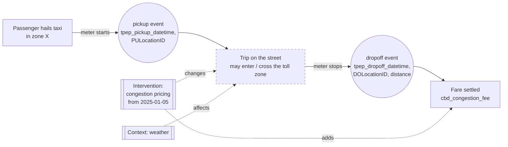
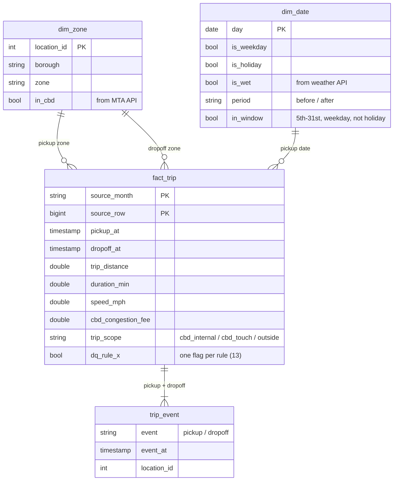

# Workflow and data model (Class 7)

## Real-world workflow → what the data can see

The dashed box is **not observed**: there is no GPS, so speed = distance / (dropoff − pickup) for the whole trip.

## Relational model (DuckDB)

| Concept | Where it lives |
|---|---|
| **Entities** | `dim_zone`, `dim_date` |
| **Event / state** | `fact_trip` (a trip moves from pickup to dropoff); `trip_event` is the long form |
| **Intervention** | `dim_date.period` + the `cbd_congestion_fee` actually charged |
| **Outcome** | speed, crawl share, and travel-time-per-mile metrics (`metrics.py`) |
| **Lineage** | `source_month`, `source_row` → `raw_trips` → the Parquet file in `manifest.json` |

Layers: `raw_*` (as delivered) → `stg_trips` (derived columns) → `fact_trip` + flags → `fact_trip_clean` (eligibility) → metrics.
